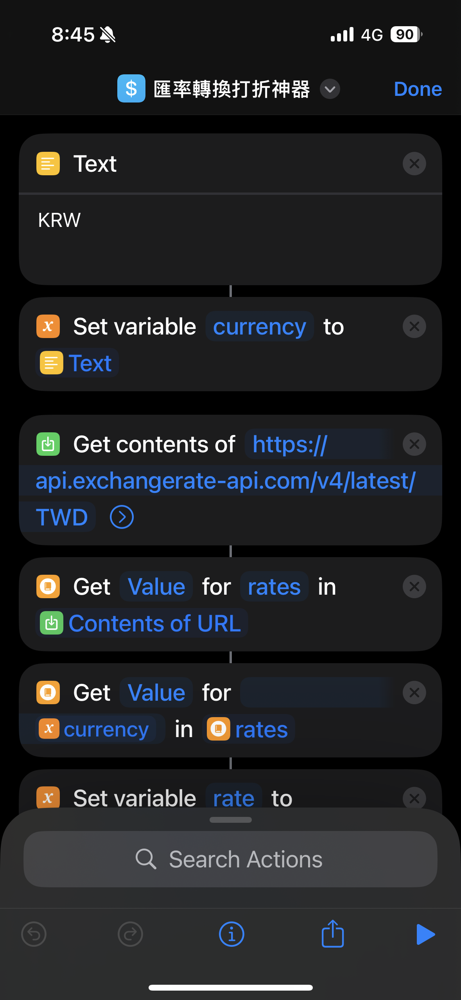
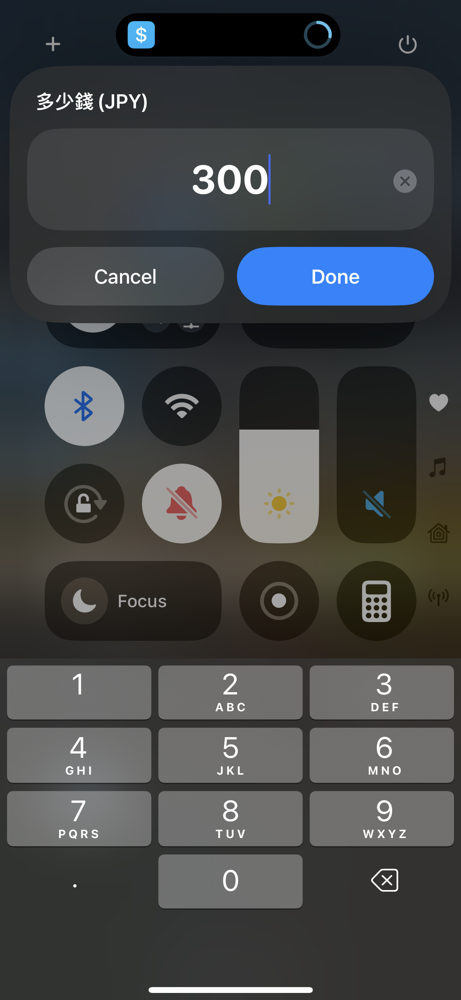
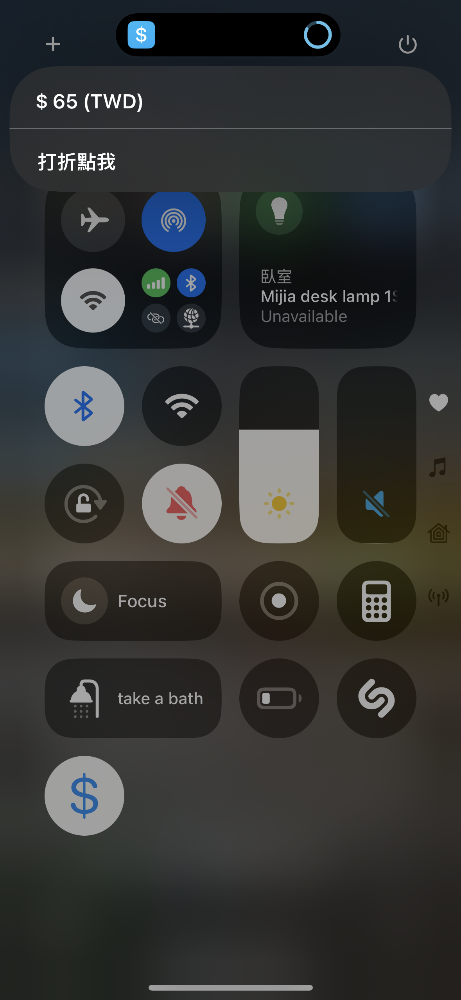
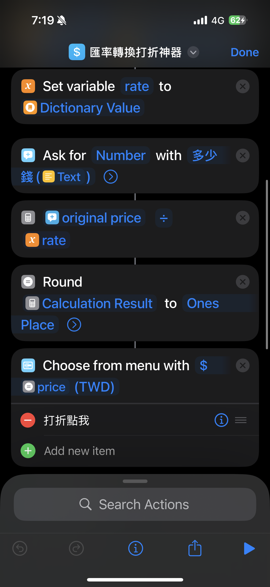
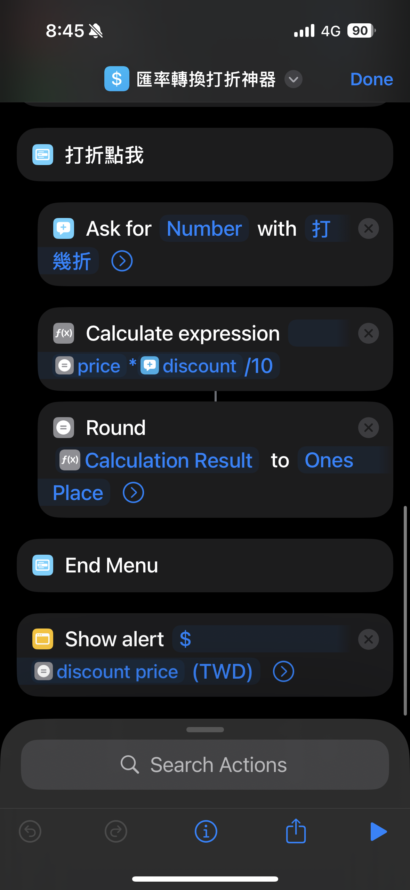

# Iphone 捷徑：匯率打折計算神器

一個基於當前匯率轉換外國貨幣到台幣且支援打折計算功能的計算機捷徑。

## 原理
1. 打[API](https://api.exchangerate-api.com/v4/latest/TWD)獲取當前台幣兌外幣匯率
2. 獲取外幣金額
3. 轉換成台幣並顯示
4. 獲取打折折數
5. 顯示打完折後的金額

## 使用教學 

[點我下載](https://www.icloud.com/shortcuts/fe7c3530a70947daaff90f4d736934f8)

[或是點我下載打包檔](https://github.com/erichung9060/Iphone-Shortcuts/raw/refs/heads/main/%E5%8C%AF%E7%8E%87%E8%BD%89%E6%8F%9B%E6%89%93%E6%8A%98%E7%A5%9E%E5%99%A8/%E5%8C%AF%E7%8E%87%E8%BD%89%E6%8F%9B%E6%89%93%E6%8A%98%E7%A5%9E%E5%99%A8.shortcut)

Step 1. 打開該捷徑，把最上面Text的內容改成你想要轉換成台幣的幣種

去日本就改`JPY`
去韓國就改`KRW`
去美國就改`USD`

Step 2. 把該捷徑新增到控制中心（左下角錢的符號，也可能是計算機的符號，可以自行更改成喜歡的圖案）

Step 3. 開啟捷徑，點擊同意，以獲取當前匯率

Step 4. 點擊該捷徑並輸入外國貨幣的金額

Step 5. 接著就會顯示轉換成台幣的金額。
如果有打折可以按下面的按鈕，沒有就按空白地方退出。

Step 6. 輸入打幾折，例如打8折就輸入8

Step 7. 顯示打折後的金額

## 流程圖

